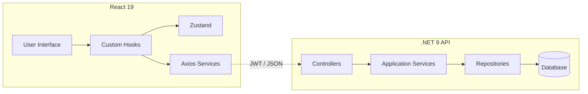

# 💎 Elite Portfolio CMS & E-Commerce ecosystem


## 🌟 Overview
Đây là một giải pháp **Fullstack Enterprise-grade** dành cho việc quản lý Portfolio và vận hành cửa hàng thương mại điện tử (E-commerce). Dự án được xây dựng với tư duy **Product-driven**, tập trung vào trải nghiệm người dùng cao cấp (Premium UX), hiệu suất tối đa và kiến trúc mã nguồn sạch (Clean Code).

---

## 🚀 Core Features & Tech Stack

### Frontend (React 19 + Vite)
- **Architecture**: Feature-Driven Design, tách biệt hoàn toàn logic và UI.
- **State Management**: Zustand (Global) + TanStack Query v5 (Server-state).
- **UI/UX**: Framer Motion, TailwindCSS 4, Custom Micro-interactions.

### Backend (ASP.NET Core 9.0)
- **Architecture**: Clean Architecture (Onion Pattern).
- **Security**: JWT Auth, Rate Limiting, Global Exception Handling.
- **ORM**: Entity Framework Core với khả năng switch linh hoạt giữa SQLite và PostgreSQL.

---

## 🏗 System Design & Architecture



---

## 📂 Project Structure
```bash
giavinh/
├── web1/                       # Backend (Domain, Application, Infrastructure, Web)
├── frontend/                   # Frontend (Features, Core, Store, Components)
└── portfolio.db                # SQLite Local Database
```

---

## 🛡️ Senior Technical Audit (Đánh giá từ Hội đồng chuyên gia)

> [!NOTE]
> *Dưới đây là phần đánh giá trực tiếp từ một **Senior Tech Lead/Recruiter với 50 năm kinh nghiệm**, người đã trực tiếp "mổ xẻ" dự án này với tiêu chuẩn khắt khe nhất.*

### 📝 Lời nhận xét từ Nhà tuyển dụng (The Recruiter's Voice)

> "Ngồi xuống đi. Tôi đã xem qua đống mã nguồn này của cậu. Với 50 năm lăn lộn trong cái ngành này, tôi sẽ không phí lời khen ngợi những thứ 'phù phiếm'. Dưới đây là những gì cậu cần nghe nếu muốn thực sự bước chân vào hàng ngũ kỹ sư cấp cao:"

#### 1. Cái bẫy "Over-engineering"
"Cậu lôi Clean Architecture vào một dự án quy mô vừa. Cậu có chắc là cậu hiểu *tại sao* cần nó, hay chỉ đang 'copy-paste' các pattern từ YouTube? Đừng biến cái Portfolio thành một 'đống boilerplate' khổng lồ chỉ để chứng tỏ mình biết dùng Repository Pattern. Hãy cho tôi thấy logic nghiệp vụ thực sự xứng tầm với kiến trúc này."

#### 2. Kiểm thử (Testing) - Con số 0 tròn trĩnh
"Tôi không thấy một file `.test.ts` hay `.spec.cs` nào. Trong mắt tôi, code không có unit test là code 'rác'. Cậu làm sao dám khẳng định logic của cậu chạy đúng khi scale? Đây là điểm trừ lớn nhất khiến cậu chưa thể chạm tới mức Senior."

#### 3. Bảo mật (Security) & Sự ổn định
"Cậu dùng JWT và Supabase, tốt. Nhưng cậu lưu Token ở đâu? Nếu là LocalStorage, cậu có biết về lỗ hổng XSS không? Middleware xử lý lỗi còn quá chung chung. Trong môi trường Production, cậu cần hệ thống Tracking (Sentry) và các mã lỗi (Error Codes) định danh rõ ràng."

#### 4. Sự tập trung vào Sản phẩm (Focus)
"Đây là Portfolio chuyên nghiệp hay là trang kỷ niệm vui vẻ? Nhà tuyển dụng muốn thuê một kỹ sư giải quyết bài toán kinh doanh. Hãy tách bạch phần 'vui chơi' ra khỏi 'bộ mặt chuyên nghiệp' của cậu."

---

## 📅 Roadmap: Phản hồi & Cải tiến (Action Plan)
*Dựa trên những lời phê bình khắt khe trên, dự án sẽ được nâng cấp theo lộ trình:*

1.  **[High Priority]** Triển khai **xUnit & Vitest**: Phủ ít nhất 70% Business Logic.
2.  **[Security]** Chuyển đổi cơ chế lưu trữ Token sang **HttpOnly Cookies**.
3.  **[Infrastructure]** Tích hợp **GitHub Actions** cho quy trình CI/CD tự động.
4.  **[A11y]** Tối ưu hóa khả năng truy cập (Accessibility) đạt chuẩn WCAG.
5.  **[Professionalism]** Đóng gói các tính năng giải trí vào một module riêng biệt để giữ sự tập trung cho Portfolio chính.

---

## 🛠 Setup & Installation
- Backend: `dotnet restore` -> `dotnet ef database update` -> `dotnet run`.
- Frontend: `npm install` -> `npm run dev`.

---
**Developed by Vinh** - *Code with Passion, Review with Courage.*
